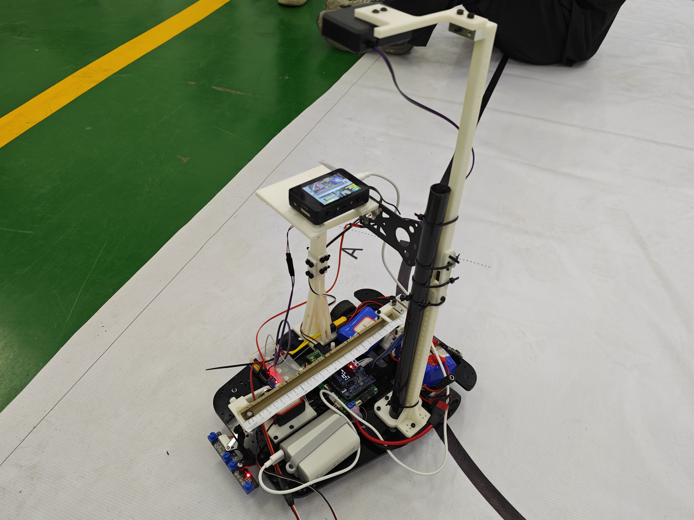
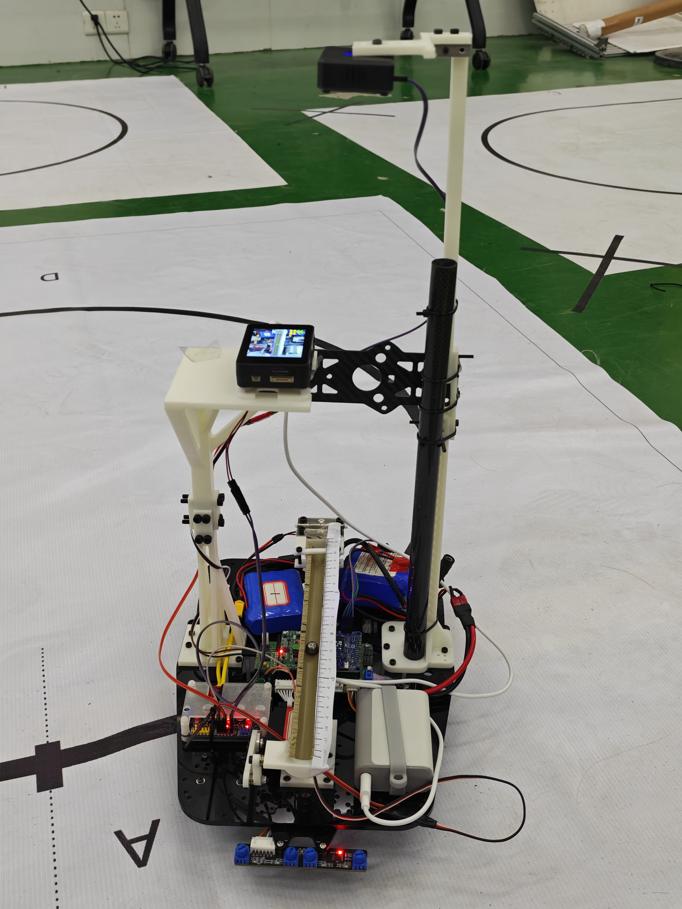

# Elec_Contest — 钢球识别与定位视觉方案

面向 RoboMaster 电赛的视觉系统，运行在 **幻尔（Hiwonder）K230** 开发板（基于嘉楠 K230 芯片，CanMV v1.5）上。完成「摄像头采集 → 深度学习识别钢球 → 目标框平滑 → PnP 测距 → UART 发送给电控」的完整链路。

## 实物展示

基于幻尔 K230 的 RoboMaster 电赛小车，本视觉方案部署于其上。





## 功能特性

- **深度学习检测**：基于 K230 官方 `DetectionApp`，加载 `.kmodel` 模型（AnchorBaseDet，320×320 输入）识别钢球（`steel_ball`）。
- **ROI 过滤**：仅在画面中部水平条带内保留检测框，降低误检、聚焦有效区域。
- **目标框平滑**：EMA + 速度预测的平滑器（`alpha=0.65`），在检测丢失时保持框并持续预测，超时后重置。
- **PnP 测距**：基于 `cv_lite.rgb888_pnp_distance`，结合相机内参/畸变系数估计钢球的水平偏移 `x_cm` 与垂直距离 `z_cm`。
- **UART 通讯**：7 字节二进制帧协议，将 `x_cm` 实时发送给电控端。
- **OSD 实时显示**：绘制 ROI、原始框（红）、平滑框（绿）、零点虚线、帧率、置信度与测距结果。

## 硬件环境

| 项目 | 说明 |
| --- | --- |
| 开发板 | 幻尔（Hiwonder）K230（嘉楠 K230 芯片，CanMV v1.5） |
| 摄像头分辨率 | 1280×720 |
| 模型输入 | 320×320 |
| 检测目标 | 钢球（直径 1.0 cm） |
| 通讯 | UART3，115200 baud，TX=IO50，RX=IO51 |

## 目录结构

```
Elec_Contest/
├── main.py                 # 主入口：采集、识别、平滑、测距、显示、发送
├── detector.py             # 深度学习识别模块（封装 DetectionApp）
├── pnp_estimator.py        # PnP 位置估计（x 偏移 / 距离）
├── kalman_filter.py        # 检测框平滑器（EMA + 速度预测）
├── uart_comm.py            # UART 二进制帧通讯
├── calib_nogui.py          # 相机内参标定脚本（无 GUI，运行于 PC）
├── camera_1_K.npy          # 相机内参矩阵（标定结果）
├── camera_1_D.npy          # 相机畸变系数（标定结果）
└── mp_deployment_source/   # 模型部署目录
    ├── deploy_config.json  # 部署配置（阈值、anchors、类别等）
    └── *.kmodel            # 编译后的检测模型（已 gitignore）
```

## 系统流程

```
摄像头帧 (1280×720)
      │
      ▼
Detector.infer()        深度学习识别钢球
      │
      ▼
ROI 后过滤             仅保留中心位于中部条带内的框
      │
      ▼
KalmanBoxFilter        速度预测 + EMA 平滑（检测丢失时保持预测）
      │
      ▼
PnPEstimator.estimate  由平滑框计算 x_cm / z_cm
      │
      ├──► UartComm.send(x_cm)   发送给电控
      └──► OSD 显示
```

## 各模块说明

### main.py（主入口）

初始化 LCD 背光、`PipeLine` 采集管线、检测器、PnP、平滑器与 UART，随后进入主循环。关键配置：

- `RGB888P_SIZE = [1280, 720]`：采集分辨率。
- `ROI = [0, (720-100)//2, 1280, 100]`：全宽、垂直居中的水平条带（高度 100px），可设为 `None` 关闭。
- `X_OFFSET_CM = 0.8` / `CX_OFFSET_PX = 4`：零点补偿（正 = 右移）。
- `CAMERA_MATRIX` / `DIST_COEFFS`：1280×720 下的相机标定参数。
- `MAX_LOST = 15`：检测丢失后平滑器继续预测的最大帧数，超时后重置。

### detector.py

封装 K230 官方 `DetectionApp`，从 `deploy_config.json` 读取模型路径、类别、阈值与 anchors。`infer()` 返回检测结果并完成 ROI 后过滤。

### pnp_estimator.py

调用 `cv_lite.rgb888_pnp_distance` 估算钢球距离，再通过小孔成像模型由框中心反推水平偏移：

```python
x_cm = (u - iw/2) * dist / fx - x_offset_cm
```

返回 `(x_cm, dist)`，其中 `x_cm` 为沿摆杆方向的水平偏移（0 位于图像中心），`dist` 为垂直距离。

### kalman_filter.py

虽名为 Kalman，实为 **EMA + 速度预测** 的轻量平滑器：

1. 由前后位置估计速度 `v = pos - prev_pos`；
2. 用速度预测下一帧位置，抵消 EMA 滞后；
3. 加权平滑 `out = alpha*meas + (1-alpha)*pred`（默认 `alpha=0.65`）。

在目标短暂丢失时，`predict()` 会继续推进框位置，保证测距与显示连续。

### uart_comm.py

通过 FPIOA 映射引脚并初始化 UART，以二进制帧发送 `x_cm`（×100 转 int16）。帧格式如下。

## UART 通讯协议

7 字节帧，小端序，`send_interval_ms` 默认 50ms 防拥堵：

| 字节 | 字段 | 说明 |
| --- | --- | --- |
| 0 | Header0 | `0xAA` 帧头 |
| 1 | Header1 | `0x55` |
| 2 | Length | `0x02`（数据长度） |
| 3–4 | x_cm | `int16` 小端，`x_cm × 100` |
| 5 | Checksum | `XOR(byte2 ~ byte4)` |
| 6 | Tail | `0xED` 帧尾 |

示例：`x = 12.34 cm` → `x_cm×100 = 1234 = 0x04D2`，校验 `0x02 ^ 0xD2 ^ 0x04 = 0xD4`：

```
AA 55 02 D2 04 D4 ED
```

## 相机标定

`calib_nogui.py` 为无 GUI 版张正友标定脚本，运行于 PC（需 `opencv-python`、`numpy`）：

1. 采集棋盘格（9×6 内角点，方格 10mm）图片，默认从相机 MTP 路径读取；
2. `cv2.findChessboardCorners` 提取角点并亚像素细化；
3. `cv2.calibrateCamera` 标定内参与畸变；
4. 结果保存为 `camera_1_K.npy`、`camera_1_D.npy`。

注意：脚本默认 `FRAME_WIDTH/HEIGHT = 320×240`，需与最终采集分辨率（1280×720）一致时方可将内参写入 `main.py`。

## 部署与运行

1. 将模型（`.kmodel`）与 `deploy_config.json` 放入 `mp_deployment_source/`；
2. 将本项目部署到 K230 的 `/sdcard/Elec_Contest`；
3. 在 CanMV IDE 中运行 `main.py`（`ROOT_PATH` 默认指向 `/sdcard/mp_deployment_source`）。

## 配置要点

- **阈值**：`deploy_config.json` 中 `confidence_threshold=0.4`、`nms_threshold=0.5`，可按现场光照调整。
- **ROI 高度**：`ROI_HEIGHT=100`，根据钢球直径（~1cm）与摆杆位置调整。
- **零点补偿**：现场调车时通过 `X_OFFSET_CM` 与 `CX_OFFSET_PX` 微调零点偏移。
